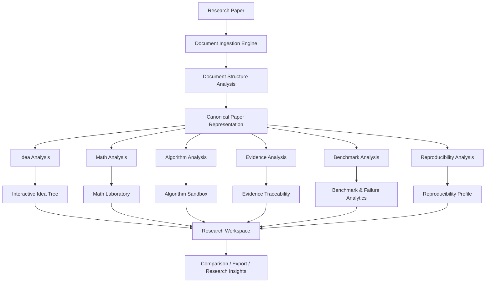
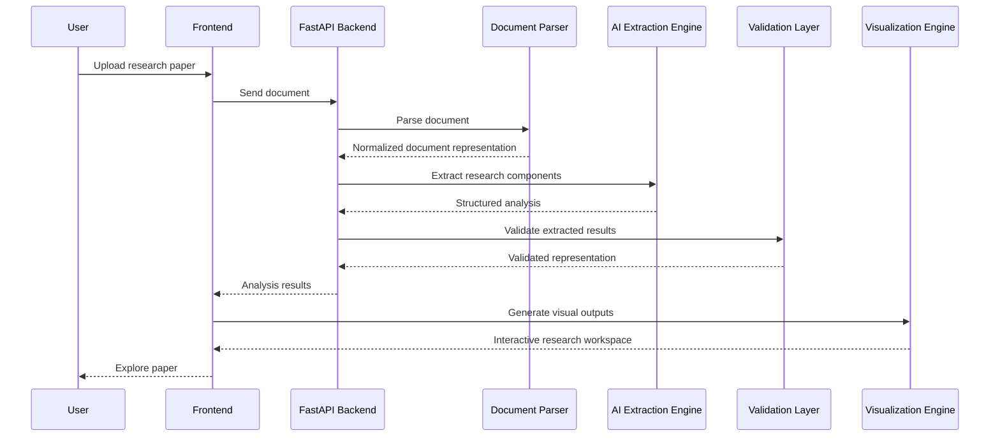
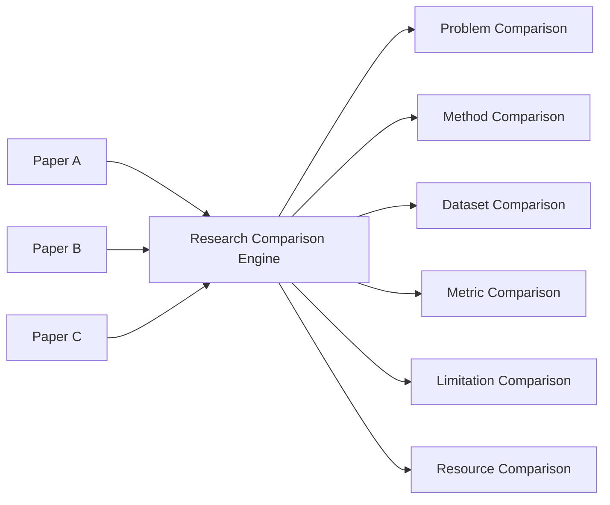
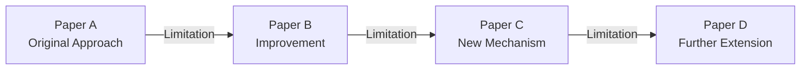
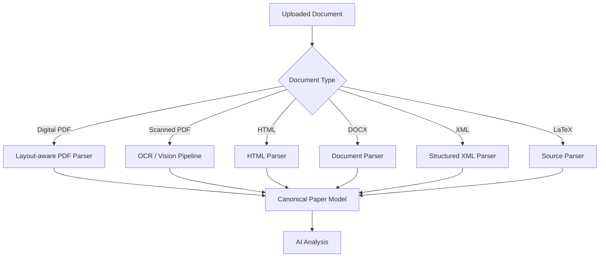
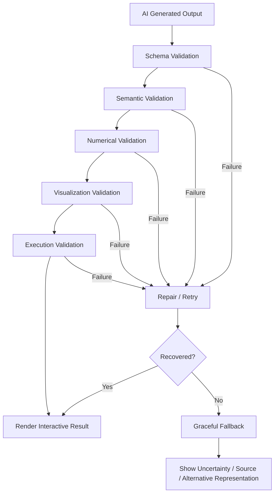
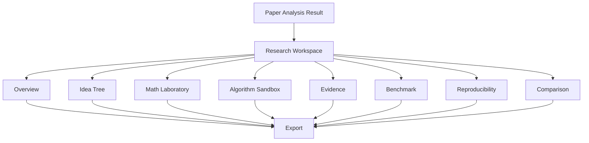
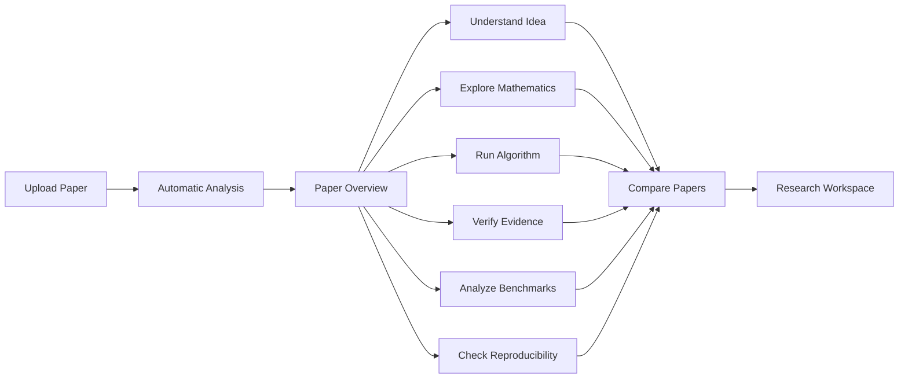
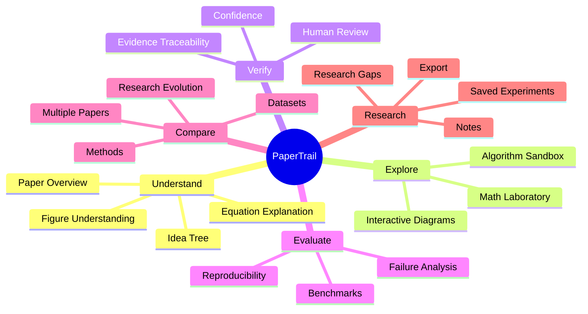

# PaperTrail
### AI-Powered Research Comprehension, Experimentation & Evidence Platform

<p align="center">
  <strong>Turn complex research papers into an interactive research workspace.</strong>
</p>

<p align="center">
  Upload a research paper → Understand its ideas → Explore its mathematics → Execute its core algorithm → Verify evidence → Analyze results → Compare research
</p>

---

## Overview

Research papers contain valuable knowledge, but extracting that knowledge efficiently can be difficult.

A single paper may contain:

- Dense mathematical formulations
- Complex algorithms and pseudocode
- Multiple experimental results
- Large benchmark tables
- Architecture diagrams
- Figures and visual explanations
- Technical terminology
- Numerous assumptions and limitations
- Important information distributed across different sections

PaperTrail is designed to reduce the effort required to understand and investigate this information.

Instead of providing only a conventional summary, PaperTrail transforms a research paper into an **interactive research workspace**.

The system analyzes a paper and converts important components into structured, explorable representations such as:

- Research Idea Trees
- Interactive Mathematical Models
- Executable Algorithm Simulations
- Evidence-linked Claims
- Benchmark Analytics
- Failure and Limitation Analysis
- Reproducibility Information
- Multi-paper Comparisons

The long-term goal is to make research papers **understandable, inspectable, experimentable, and traceable**.

---

# Why PaperTrail?

Traditional research-paper reading often looks like:

```text
Research Paper
      │
      ▼
Read Introduction
      │
      ▼
Read Related Work
      │
      ▼
Understand Method
      │
      ▼
Search for Equations
      │
      ▼
Understand Algorithm
      │
      ▼
Inspect Tables/Figures
      │
      ▼
Read Experiments
      │
      ▼
Make Personal Notes
      │
      ▼
Compare With Other Papers
````

This process can require substantial time and effort.

PaperTrail aims to compress this workflow:

```text
                 RESEARCH PAPER
                       │
                       ▼
               DOCUMENT ANALYSIS
                       │
                       ▼
             STRUCTURED PAPER MODEL
                       │
       ┌───────────────┼────────────────┐
       ▼               ▼                ▼
   IDEA MODEL       MATH MODEL      ALGORITHM MODEL
       │               │                │
       ▼               ▼                ▼
   Idea Tree      Math Laboratory   Code Sandbox
       │               │                │
       └───────────────┼────────────────┘
                       ▼
                EVIDENCE & VALIDATION
                       │
                       ▼
             BENCHMARK / LIMITATIONS
                       │
                       ▼
              RESEARCH WORKSPACE
```

---

# Core Vision

PaperTrail is not intended to be just:

> "Chat with a PDF"

or:

> "Generate a summary of a research paper."

The objective is to build a system that can transform static research information into **interactive computational representations**.

The core philosophy is:

```text
              STATIC RESEARCH
                     │
                     ▼
             AI DECONSTRUCTION
                     │
                     ▼
            STRUCTURED KNOWLEDGE
                     │
        ┌────────────┼────────────┐
        ▼            ▼            ▼
   UNDERSTAND    EXPERIMENT     VERIFY
        │            │            │
        └────────────┼────────────┘
                     ▼
              RESEARCH WORKFLOW
```

---

# High-Level Architecture



---

# End-to-End Processing Pipeline



---

# Current System

The current repository contains the initial working PaperTrail implementation.

### Current pipeline

```text
PDF
 │
 ▼
pymupdf4llm
 │
 ▼
Clean Markdown
 │
 ├──────────────┬─────────────────┐
 ▼              ▼                 ▼
Math         Idea Tree      Algorithm
 │              │                 │
 ▼              ▼                 ▼
Plotly        Mermaid          Python
 │              │                 │
 └──────────────┼─────────────────┘
                ▼
        Interactive Interface
```

The current implementation is built around three primary modules:

1. Math Simulator
2. Idea Tree
3. Algorithm Sandbox

Additional research-oriented capabilities are part of the planned final-year expansion.

---

# Feature Set

## 1. Research Idea Tree

The Idea Tree extracts the narrative structure of a research paper.

The current representation follows:

```text
Prior Baseline
       │
       ▼
Bottleneck Identified
       │
       ▼
Core Novelty
       │
       ▼
Impact
```

### Example

```text
┌─────────────────────────────┐
│ Prior Baseline              │
│ Existing approach           │
└─────────────┬───────────────┘
              ↓
┌─────────────────────────────┐
│ Bottleneck                  │
│ What problem existed?       │
└─────────────┬───────────────┘
              ↓
┌─────────────────────────────┐
│ Core Novelty                │
│ What did the paper change?  │
└─────────────┬───────────────┘
              ↓
┌─────────────────────────────┐
│ Impact                      │
│ What did it achieve?        │
└─────────────────────────────┘
```

### Current visualization

The frontend uses Mermaid.js for graph-based rendering and also provides an interactive flowchart-style representation.

Planned improvements include:

* Evidence-linked nodes
* Expandable research branches
* Interactive source references
* Research evolution graphs
* Multi-paper lineage visualization

---

# 2. Interactive Math Laboratory

The Math Laboratory converts suitable mathematical formulations into interactive models.

Instead of only displaying:

$$
f(x,\theta)
$$

PaperTrail aims to provide:

```text
Parameter
    │
    ▼
Interactive Slider
    │
    ▼
Numerical Evaluation
    │
    ▼
Visualization
    │
    ▼
Sensitivity / Interpretation
```

### Example

```text
Parameter: γ

0.0 ─────────────●────────────── 5.0
                 2.0
```

Changing the parameter changes the visualization dynamically.

### Current technology

* NumPy
* Python evaluation
* Plotly
* React Plotly

### Planned capabilities

* 2D plots
* 3D visualizations where appropriate
* Parameter sensitivity
* Valid parameter domains
* Numerical stability checks
* Invalid-domain detection
* Symbol descriptions
* Evidence/source references
* Saved experiments

---

# 3. Algorithm Sandbox

Research algorithms are frequently difficult to understand from pseudocode alone.

PaperTrail converts the algorithm into a simplified executable representation.

```text
Original Algorithm
       │
       ▼
AI Interpretation
       │
       ▼
Simplified Python
       │
       ▼
Synthetic Input
       │
       ▼
Sandbox Execution
       │
       ▼
Intermediate Results
       │
       ▼
Final Output
```

### Example interface

```text
┌──────────────────────────┬──────────────────────────┐
│ Original Pseudocode      │ Executable Python        │
│                          │                          │
│ Step 1                  │ def algorithm(...):      │
│ Step 2                  │     ...                  │
│ Step 3                  │     ...                  │
└──────────────────────────┴──────────────────────────┘

                   [ Run Simulation ]

┌──────────────────────────────────────────────────────┐
│ Execution Output                                     │
│                                                      │
│ Step 1: Initialized synthetic data                   │
│ Step 2: Applied transformation                       │
│ Step 3: Computed output                              │
│ Result: ...                                          │
└──────────────────────────────────────────────────────┘
```

The current backend executes generated Python using a subprocess-based execution mechanism with timeout handling and one automatic repair attempt for execution failures.

### Planned improvements

* Step-by-step execution
* Intermediate-state visualization
* More robust sandbox isolation
* Resource limits
* Static safety checks
* Dependency restrictions
* Execution telemetry
* Better error diagnosis
* Deterministic fallback simulations

---

# 4. Evidence Traceability

### Planned major feature

Every important extracted result should be traceable to its source within the paper.

For example:

```text
Extracted Claim
      │
      ▼
Evidence Resolver
      │
      ▼
Page 7
      │
      ▼
Section 3.2
      │
      ▼
Table 4
      │
      ▼
Exact supporting content
```

A result should ideally contain:

```text
{
    "value": "...",
    "source_page": 7,
    "source_section": "Methodology",
    "source_type": "table",
    "confidence": 0.94
}
```

This helps distinguish:

* explicitly reported information
* inferred information
* simplified information
* uncertain information

---

# 5. Benchmark & Failure Analysis

A research paper's headline metric does not tell the whole story.

PaperTrail is designed to extract and organize:

* Baseline results
* Proposed method results
* Dataset information
* Evaluation metrics
* Runtime
* Memory requirements
* Computational requirements
* Ablation results
* Reported limitations
* Failure cases

### Planned visualization

```text
                PERFORMANCE

Baseline     ███████████████
Method       ███████████████████
Method + X   █████████████████████
```

### Where It Breaks

```text
                  METHOD
                    │
        ┌───────────┼───────────┐
        ▼           ▼           ▼
     Works      Degrades      Fails
        │           │           │
        ▼           ▼           ▼
   Normal data   Low data    Edge cases
   Standard      Shift       Unsupported
   setting       conditions  conditions
```

The objective is to help answer:

> Under what conditions does the reported method operate successfully, and what limitations are documented?

---

# 6. Reproducibility Profile

Research results can be difficult to reproduce when required information is incomplete.

PaperTrail plans to generate a structured reproducibility profile.

```text
Dataset                    ✓
Code availability          ✓
Preprocessing details      ✓
Hyperparameters            ⚠
Hardware                   ✓
Random seed                ✗
Environment                ⚠
External dependencies      ✓
```

### Planned output

```text
┌─────────────────────────────────────┐
│ REPRODUCIBILITY PROFILE             │
├─────────────────────────────────────┤
│ Dataset                  ✓          │
│ Source Code              ✓          │
│ Environment              ⚠          │
│ Hyperparameters          ⚠          │
│ Random Seed              ✗          │
│ Hardware                 ✓          │
└─────────────────────────────────────┘
```

This is intended as an information-completeness analysis rather than a claim that a study is scientifically valid or invalid.

---

# 7. Multi-Paper Comparison

PaperTrail is planned to support comparison across multiple research papers.



### Example

| Dimension  | Paper A  | Paper B  | Paper C  |
| ---------- | -------- | -------- | -------- |
| Problem    | ✓        | ✓        | ✓        |
| Dataset    | A        | B        | A        |
| Method     | X        | Y        | Z        |
| Evaluation | Metric 1 | Metric 1 | Metric 1 |
| Compute    | Low      | High     | Medium   |
| Limitation | L1       | L2       | L3       |

Planned capabilities include:

* Side-by-side comparison
* Research evolution
* Method lineage
* Dataset overlap
* Result comparison
* Limitation comparison

---

# 8. Research Evolution Explorer

A group of papers can be interpreted as a progression:



This helps researchers understand:

> How did a research idea evolve over time?

rather than reading each paper independently.

---

# 9. Research Gap Explorer

A planned evidence-oriented research-gap module will analyze multiple papers and identify areas that appear under-investigated.

The system should not simply produce:

> "Your research gap is X."

Instead, it should show the evidence.

```text
Paper A
  │
  └── Limitation L1

Paper B
  │
  └── Limitation L2

Paper C
  │
  └── Limitation L1

       ↓

Common unresolved area
       ↓
Supporting evidence
       ↓
Contradicting evidence
       ↓
Research opportunity
```

The researcher remains responsible for interpreting whether an identified opportunity is genuinely a research gap.

---

# Universal Document Processing

A major long-term objective is robust processing across diverse research-document structures.

Potential inputs include:

```text
PDF
Scanned PDF
Multi-column PDF
Equation-heavy PDF
Table-heavy PDF
Figure-heavy PDF
DOC/DOCX
HTML
XML/JATS
LaTeX/source packages
```

The processing architecture is intended to use multiple extraction strategies:



### Important reliability principle

The goal is **not** to silently claim perfect understanding.

The goal is:

> **Robust processing + validation + transparent uncertainty + graceful fallback.**

---

# Multimodal Paper Understanding

A paper is more than plain text.

PaperTrail's planned canonical representation is:

```text
Paper
│
├── Metadata
├── Sections
├── Paragraphs
├── Equations
├── Variables
├── Tables
├── Figures
├── Captions
├── Algorithms
├── References
├── Claims
├── Datasets
├── Metrics
├── Experiments
├── Limitations
└── Evidence Links
```

This structured representation becomes the common source for downstream modules.

---

# Validation & Reliability Architecture

One of the most important engineering goals of the project is to prevent invalid AI output from directly breaking the user interface.



### Design principle

No silent failure.

The system should communicate whether information was:

```text
✓ Explicitly extracted
✓ Validated
⚠ Inferred
⚠ Simplified
⚠ Partially available
✗ Unavailable
```

---

# Visualization Reliability

All generated visualizations should pass validation before being displayed.

## Mathematical visualization validation

Checks may include:

```text
✓ Valid equation
✓ Valid parameter domain
✓ No division-by-zero
✓ No invalid logarithm domain
✓ No NaN
✓ No infinite values
✓ Valid x/y lengths
✓ Non-empty data
```

## Graph validation

```text
✓ Unique node IDs
✓ Valid edges
✓ No broken references
✓ Valid renderer syntax
✓ No orphan nodes
```

## Table validation

```text
✓ Consistent columns
✓ Valid numerical types
✓ Missing-value detection
✓ Correct row alignment
```

## Code validation

```text
✓ Syntax validation
✓ Dependency validation
✓ Sandbox restrictions
✓ Timeout
✓ Memory constraints
✓ Output validation
```

---

# Graceful Degradation

PaperTrail should remain useful even when an advanced operation fails.

```text
Primary extraction
      │
      ▼
   Success
      │
      ▼
Interactive output
```

If it fails:

```text
Primary extraction
      │
      ▼
Alternative extraction
      │
      ▼
Success?
```

If still unavailable:

```text
Structured extracted data
      +
Original source
      +
Uncertainty explanation
```

The expected user experience should therefore avoid:

```text
Blank screen
500 error
Broken chart
Broken diagram
Unexplained result
```

---

# Current API

The current FastAPI backend provides endpoints for the core prototype.

| Endpoint                  | Purpose                                         |
| ------------------------- | ----------------------------------------------- |
| `GET /`                   | Backend health check                            |
| `POST /parse-pdf`         | Parse uploaded PDF                              |
| `POST /extract-math`      | Extract interactive mathematical representation |
| `POST /evaluate-formula`  | Evaluate the mathematical model                 |
| `POST /extract-idea-tree` | Extract the research narrative                  |
| `POST /extract-algorithm` | Generate runnable algorithm representation      |
| `POST /run-algorithm`     | Execute generated algorithm code                |

---

# Technology Stack

## Backend

| Technology            | Role                  |
| --------------------- | --------------------- |
| Python                | Core backend language |
| FastAPI               | REST API              |
| Pydantic              | Structured validation |
| PyMuPDF / PyMuPDF4LLM | PDF processing        |
| Groq                  | AI inference layer    |
| NumPy                 | Numerical computation |
| Uvicorn               | ASGI server           |

## Frontend

| Technology   | Role                                   |
| ------------ | -------------------------------------- |
| React        | User interface                         |
| Vite         | Frontend build system                  |
| Axios        | API communication                      |
| Plotly       | Interactive mathematical visualization |
| Mermaid.js   | Research graphs / idea trees           |
| React Router | Application routing                    |

---

# System Architecture

```text
┌──────────────────────────────────────────────────────┐
│                    USER INTERFACE                    │
│                      React + Vite                    │
├──────────────────────────────────────────────────────┤
│                                                     │
│ Overview │ Idea Tree │ Math Lab │ Code Sandbox      │
│                                                     │
│ Evidence │ Benchmark │ Comparison │ Workspace       │
│                                                     │
└───────────────────────┬──────────────────────────────┘
                        │
                        │ REST API
                        ▼
┌──────────────────────────────────────────────────────┐
│                    FASTAPI BACKEND                   │
├──────────────────────────────────────────────────────┤
│                                                      │
│ Document Ingestion                                   │
│ AI Extraction                                        │
│ Validation                                           │
│ Mathematical Evaluation                              │
│ Algorithm Execution                                  │
│ Evidence Processing                                  │
│ Benchmark Analysis                                   │
│                                                      │
└───────────────┬───────────────────────┬───────────────┘
                │                       │
                ▼                       ▼
       Document Processing          AI Layer
       PyMuPDF / Vision             Groq / LLM
                │                       │
                └───────────┬───────────┘
                            ▼
                  Canonical Paper Model
                            │
                            ▼
                     Analysis Modules
```

---

# Project Structure

The current working baseline is being progressively reorganized into a more maintainable architecture.

Target structure:

```text
PaperTrail/
│
├── backend/
│   │
│   ├── app/
│   │   ├── api/
│   │   ├── extraction/
│   │   ├── analysis/
│   │   ├── validation/
│   │   ├── rendering/
│   │   ├── models/
│   │   ├── services/
│   │   └── core/
│   │
│   ├── tests/
│   ├── requirements.txt
│   └── Dockerfile
│
├── frontend/
│   │
│   ├── src/
│   │   ├── components/
│   │   ├── modules/
│   │   │   ├── overview/
│   │   │   ├── idea-tree/
│   │   │   ├── math-lab/
│   │   │   ├── algorithm-sandbox/
│   │   │   ├── evidence/
│   │   │   ├── benchmark/
│   │   │   └── comparison/
│   │   │
│   │   ├── services/
│   │   ├── hooks/
│   │   ├── utils/
│   │   └── styles/
│   │
│   ├── public/
│   └── package.json
│
├── docs/
│   ├── architecture/
│   ├── api/
│   ├── research/
│   └── testing/
│
├── tests/
│
├── README.md
├── LICENSE
└── .gitignore
```

---

# Frontend Output Architecture



---

# Research Workspace

The planned workspace allows researchers to retain their analysis instead of treating each upload as a temporary session.

Conceptually:

```text
User
│
├── Research Project
│   │
│   ├── Paper A
│   │   ├── Analysis
│   │   ├── Experiments
│   │   └── Notes
│   │
│   ├── Paper B
│   │   ├── Analysis
│   │   └── Notes
│   │
│   └── Comparison
│
└── Research Project 2
```

Planned saved objects include:

* Uploaded papers
* Analysis results
* Mathematical experiments
* Algorithm runs
* Notes
* Paper comparisons
* Evidence references
* Exported reports

---

# Human-in-the-Loop Design

PaperTrail is designed to assist researchers, not replace their judgment.

The intended workflow is:

```text
AI Extraction
      │
      ▼
Structured Result
      │
      ▼
Evidence / Confidence
      │
      ▼
Human Verification
      │
      ▼
Interactive Exploration
```

Researchers should be able to correct or override uncertain extracted information.

Examples:

```text
Edit Equation
Edit Parameter
Correct Research Stage
Approve Evidence
Modify Interpretation
Reject Inference
```

---

# Trust & Transparency

PaperTrail distinguishes between:

### Reported

Information explicitly stated in the paper.

### Inferred

Information derived from context.

### Simplified

Information intentionally reduced for interactive demonstration.

### Generated

New explanatory material created by the system.

### Uncertain

Information for which the system lacks sufficient evidence.

Example:

```text
Parameter Range

Reported range:
0.0 – 5.0

Confidence:
High

Source:
Section 4.2
```

or:

```text
Suggested exploratory range:
0.0 – 5.0

Status:
INFERRED / NOT EXPLICITLY REPORTED
```

This distinction is a core part of the planned trustworthy-analysis architecture.

---

# Security Considerations

PaperTrail handles AI-generated code and therefore requires strict execution controls.

The target execution architecture is:

```text
Generated Code
      │
      ▼
Static Safety Validation
      │
      ▼
Dependency Allowlist
      │
      ▼
Isolated Sandbox
      │
      ├── Timeout
      ├── Memory Limit
      ├── CPU Limit
      └── Network Disabled
      │
      ▼
Output Validation
      │
      ▼
User Result
```

The system should never provide generated code unrestricted access to:

* filesystem operations
* operating-system commands
* secrets
* network resources
* production infrastructure

---

# Reliability Targets

The following are engineering goals for the final-year implementation:

| Area               | Target                             |
| ------------------ | ---------------------------------- |
| Document ingestion | Handle diverse document structures |
| Extraction         | Structured and schema-validated    |
| Evidence           | Source-linked where possible       |
| Math               | Numerically validated              |
| Graphs             | Renderer-validated                 |
| Code               | Sandboxed and timeout-protected    |
| Visualization      | No silent rendering failures       |
| Errors             | Graceful fallback                  |
| AI uncertainty     | Explicitly surfaced                |
| User work          | Persistent and recoverable         |

---

# Development Roadmap

## Phase 1 — Working Baseline

* PDF ingestion
* Math Simulator
* Idea Tree
* Algorithm Sandbox
* Plotly visualization
* Mermaid visualization
* Safe execution baseline

### Status

```text
████████████████████████████████  Baseline
```

---

## Phase 2 — Universal Document Intelligence

* Robust multi-format ingestion
* Better document-layout handling
* Scanned-paper processing
* Figure extraction
* Table extraction
* Equation extraction
* Algorithm detection
* Metadata extraction

```text
Document
   ↓
Structure
   ↓
Text
   +
Figures
   +
Tables
   +
Equations
   +
Algorithms
```

---

## Phase 3 — Trust & Validation

* Evidence tracing
* Confidence estimation
* Extraction validation
* Mathematical domain checks
* Graph validation
* Visualization validation
* Human correction
* Uncertainty indicators

---

## Phase 4 — Research Intelligence

* Benchmark analysis
* Failure analysis
* Reproducibility profile
* Paper comparison
* Research evolution
* Research-gap exploration

---

## Phase 5 — Research Workspace

* User accounts
* Project management
* Paper library
* Saved experiments
* Notes
* Version history
* Export

---

# Testing Strategy

Testing will be performed at several levels.

## Unit Testing

Examples:

```text
Parser validation
Schema validation
Equation validation
Graph validation
Code validation
```

## Integration Testing

```text
Upload
 ↓
Parse
 ↓
Extract
 ↓
Validate
 ↓
Render
```

## Visualization Testing

```text
Chart exists
Chart data valid
No NaN
No infinity
Correct labels
Correct axes
```

## Sandbox Testing

```text
Valid code
Invalid code
Timeout
Unsafe code
Missing dependency
Numerical failure
```

## Document Stress Testing

A diverse paper set should be used to test:

* Single-column papers
* Two-column papers
* Scanned papers
* Equation-heavy papers
* Table-heavy papers
* Figure-heavy papers
* Long papers
* Poorly formatted documents
* Papers from different publishers and repositories

---

# Expected User Experience

The intended final workflow is:



---

# Example Final Output

A processed paper may eventually produce a workspace like:

```text
┌──────────────────────────────────────────────────────────────┐
│                       PAPERTRAIL                             │
├──────────┬──────────┬───────────┬──────────┬───────────────┤
│ Overview │ Idea     │ Math Lab  │ Algorithm│ Evidence      │
├──────────┴──────────┴───────────┴──────────┴───────────────┤
│                                                              │
│ Research Problem                                             │
│ ─────────────────────────────────────────────────────────── │
│ ...                                                          │
│                                                              │
│ Idea Evolution                                               │
│                                                              │
│ Baseline → Bottleneck → Novelty → Impact                    │
│                                                              │
│ ┌──────────────────────┐   ┌──────────────────────────────┐ │
│ │ Mathematical Model   │   │ Benchmark Results            │ │
│ │                      │   │                              │ │
│ │ γ ───────●────────   │   │ Baseline █████████            │ │
│ │ α ─────●──────────   │   │ Proposed █████████████        │ │
│ │                      │   │                              │ │
│ └──────────────────────┘   └──────────────────────────────┘ │
│                                                              │
│ Algorithm Sandbox                                           │
│                                                              │
│ Original Pseudocode       Executable Simulation             │
│                                                              │
│ Evidence                                                     │
│ Page 7 · Section 3.2 · Table 4                              │
│                                                              │
└──────────────────────────────────────────────────────────────┘
```

---

# Design Philosophy

PaperTrail follows six major principles.

### 1. Understand Before Interacting

The system first constructs a structured representation of the paper before exposing interactive modules.

### 2. Evidence Over Unsupported Claims

Important results should be linked to their source whenever possible.

### 3. Interactive Over Static

Where useful, equations, algorithms, graphs, and benchmarks should be explorable rather than static.

### 4. Validation Before Rendering

AI-generated artifacts should be validated before reaching the user interface.

### 5. Graceful Failure

A failed advanced module should not destroy the entire analysis.

### 6. Human-AI Collaboration

AI performs extraction and transformation; researchers retain control over interpretation and final decisions.

---

# What Makes PaperTrail Different?

PaperTrail is designed around the transition:

```text
                   TRADITIONAL
                  PAPER READING
                       │
                       ▼
              Manual interpretation
                       │
                       ▼
                 Personal notes
```

toward:

```text
                    PAPERTRAIL
                       │
                       ▼
                Structured analysis
                       │
       ┌───────────────┼───────────────┐
       ▼               ▼               ▼
    Concept          Math           Algorithm
       │               │               │
       ▼               ▼               ▼
  Interactive       Interactive       Runnable
    Graph             Model         Simulation
       │               │               │
       └───────────────┼───────────────┘
                       ▼
                Evidence & Analysis
                       │
                       ▼
                 Research Workspace
```

The goal is not simply to make papers easier to summarize.

The goal is to make them **easier to understand, investigate, verify, experiment with, and compare**.

---

# Future Direction

The long-term vision is to make PaperTrail a general-purpose **research intelligence workspace**.



---

# Installation

## Backend

```bash
cd backend
python -m venv .venv
```

### Windows

```bash
.venv\Scripts\activate
```

### Linux / macOS

```bash
source .venv/bin/activate
```

Install dependencies:

```bash
pip install -r requirements.txt
```

Create a `.env` file:

```env
GROQ_API_KEY=your_api_key_here
```

Start the API:

```bash
uvicorn main:app --reload
```

Backend:

```text
http://127.0.0.1:8000
```

---

# Frontend

```bash
cd frontend
npm install
npm run dev
```

The Vite development server will provide the local frontend URL.

The frontend can be configured with:

```env
VITE_API_URL=http://127.0.0.1:8000
```

---

# Production Deployment

The intended deployment architecture is:

```text
                    INTERNET
                       │
          ┌────────────┴────────────┐
          ▼                         ▼
    React Frontend              FastAPI Backend
       Vercel                     Render / Cloud
          │                         │
          └────────────┬────────────┘
                       ▼
                    AI API
```

Production configuration should include:

* restricted CORS origins
* environment variables for secrets
* sandbox restrictions
* request limits
* logging
* monitoring
* error handling
* secure file handling

---

# Environment Variables

## Backend

```env
GROQ_API_KEY=
```

## Frontend

```env
VITE_API_URL=
```

Never commit API keys or secrets to Git.

---

# Current Status

| Component                    | Status           |
| ---------------------------- | ---------------- |
| React frontend               | Working baseline |
| FastAPI backend              | Working baseline |
| PDF parsing                  | Implemented      |
| Math extraction              | Implemented      |
| Math visualization           | Implemented      |
| Idea Tree                    | Implemented      |
| Algorithm extraction         | Implemented      |
| Algorithm execution          | Implemented      |
| Evidence tracing             | Planned          |
| Benchmark analysis           | Planned          |
| Failure analysis             | Planned          |
| Reproducibility profile      | Planned          |
| Multi-paper comparison       | Planned          |
| Research workspace           | Planned          |
| Universal document ingestion | In development   |
| Advanced validation layer    | In development   |

---

# Research / Academic Objective

PaperTrail is being developed as a final-year software and research project.

The project focuses on the intersection of:

* Artificial Intelligence
* Large Language Models
* Document Intelligence
* Human-Computer Interaction
* Data Visualization
* Explainable AI
* Interactive Computing
* Research Software
* Secure Code Execution
* Information Retrieval
* Knowledge Representation

Potential research directions include:

* Robust multimodal research-document understanding
* Evidence-grounded research analysis
* Interactive mathematical explanation
* Automatic algorithm-to-simulation transformation
* Research reproducibility analysis
* Multi-paper research evolution modeling
* Human-in-the-loop research intelligence

---

# Contributing

This project is currently being developed as a final-year research/software project.

Development priorities include:

```text
Reliability
↓
Correctness
↓
Evidence traceability
↓
Interactive exploration
↓
Performance
↓
User experience
```

Contributions should preserve the principle that generated research information must be distinguishable from directly reported information.

---

# Responsible AI Considerations

PaperTrail is an assistive research tool.

It should not be treated as an authoritative replacement for:

* reading the original publication
* verifying scientific claims
* reproducing experiments independently
* expert interpretation
* peer review

AI-generated explanations, simplified algorithms, inferred parameters, and research opportunities should be clearly identified.

---

# Project Development Note

This repository began from a working prototype used as a technical starting point for continued development.

The current project is being independently reorganized, extended, documented, tested, and substantially expanded toward the final-year PaperTrail architecture described above.

The repository's own development history and documentation should be treated as the authoritative record of changes made in this project.

---

# License

A license will be added after the project's code provenance and redistribution terms are finalized.

---

# Acknowledgements

PaperTrail builds on open-source software and research technologies including:

* FastAPI
* React
* Vite
* PyMuPDF
* PyMuPDF4LLM
* Pydantic
* NumPy
* Plotly
* Mermaid.js
* Groq and compatible large language model infrastructure

Each dependency remains subject to its respective license and terms.

---

# PaperTrail

### Understand research faster. Explore it deeper. Verify it properly.

```text
                 RESEARCH PAPER
                       │
                       ▼
              PAPER UNDERSTANDING
                       │
          ┌────────────┼────────────┐
          ▼            ▼            ▼
        IDEA          MATH       ALGORITHM
          │            │            │
          ▼            ▼            ▼
        GRAPH        LAB         SANDBOX
          │            │            │
          └────────────┼────────────┘
                       ▼
               EVIDENCE + ANALYSIS
                       │
                       ▼
                RESEARCH WORKSPACE
```

---

```


